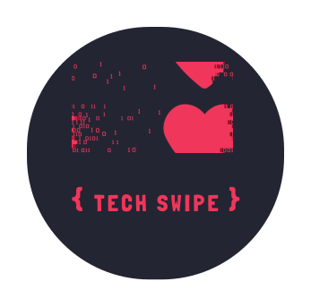

# TechSwipe

TechSwipe enables connections between developers based on their developer interests, location & developer role.

# Table of Contents

1. [Demo](#demo)
2. [Installation](#installation)
3. [Technology Stack](#techology-stack)
4. [Authors](#authors)
5. [License](#license)

 

# Demo

[Live Demo](https://techswipe.vercel.app/)

## Please Note:

1. We recommend using this app in Google Chrome
2. Use the app on any device you want.

# Installation

For Frontend of this project click [here](https://github.com/pesto-students/techswipe-frontend-p5-team1-devanshu)

Running this project should be very easy, quick and automatic using monorepo.

- Fork or directly clone this repository to your local machine
- Run `npm i` / `npm install` to install all dependencies. 
- Once the dependencies are finished installing, use the `npm run  dev` command to start the server.  
- Setup frontend by clocking this [link](https://github.com/pesto-students/techswipe-frontend-p5-team1-devanshu)

# Technology Stack

- [Node JS](https://nodejs.org/en/)
- [Express JS](https://expressjs.com/)
- [Passport](https://www.passportjs.org/)
- [Mongoose](https://mongoosejs.com/)
- [Socket.io](https://socket.io/)
- [Cloudinary](https://cloudinary.com/)

# Mentor

- Devanshu Litoria

# Authors

- Reegan Benny
- Sridhar katta

# License

- MIT
